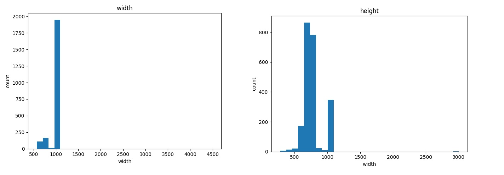
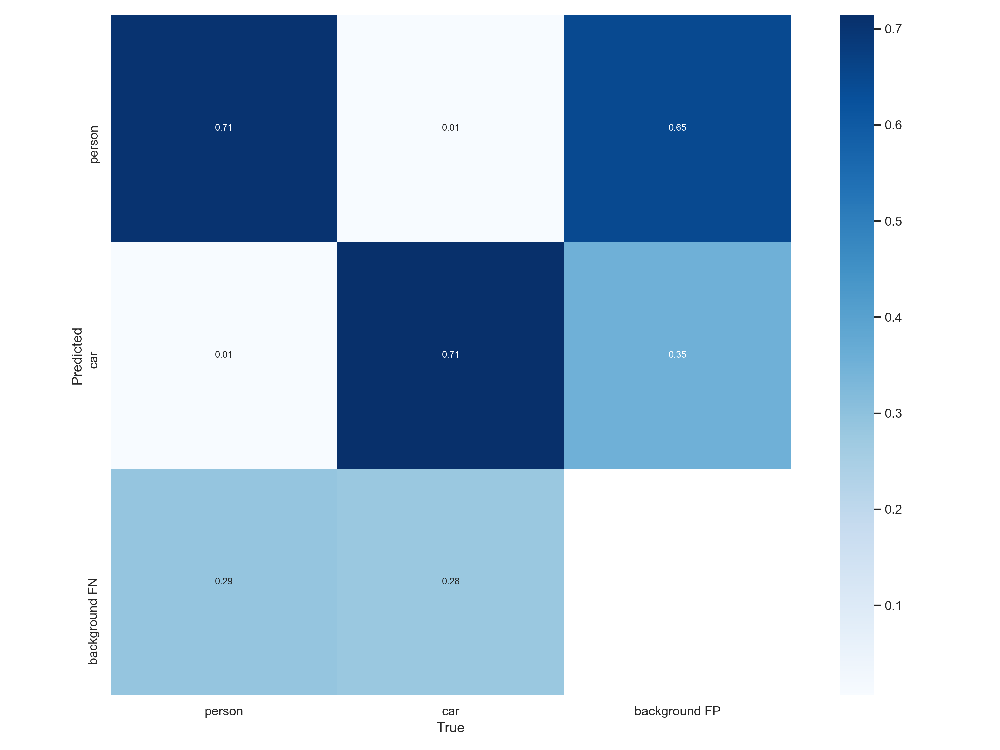
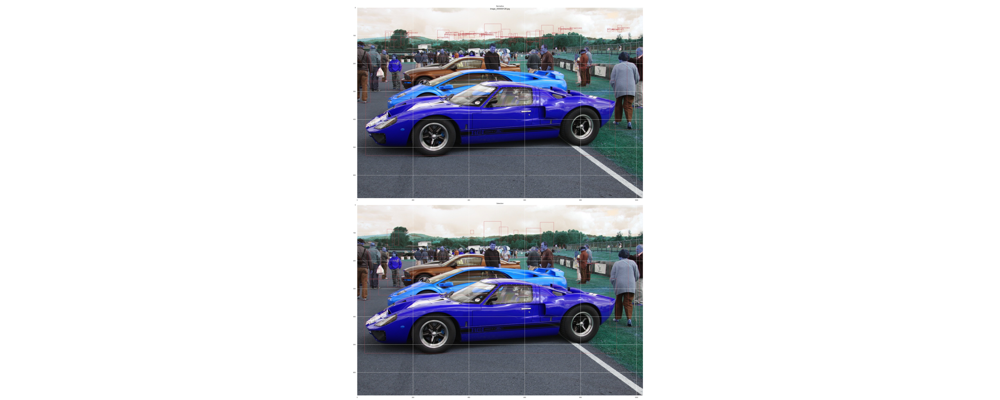
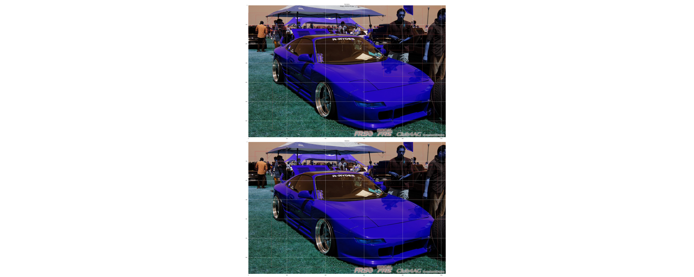
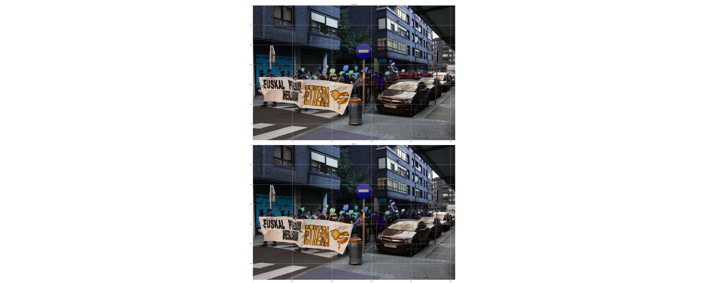
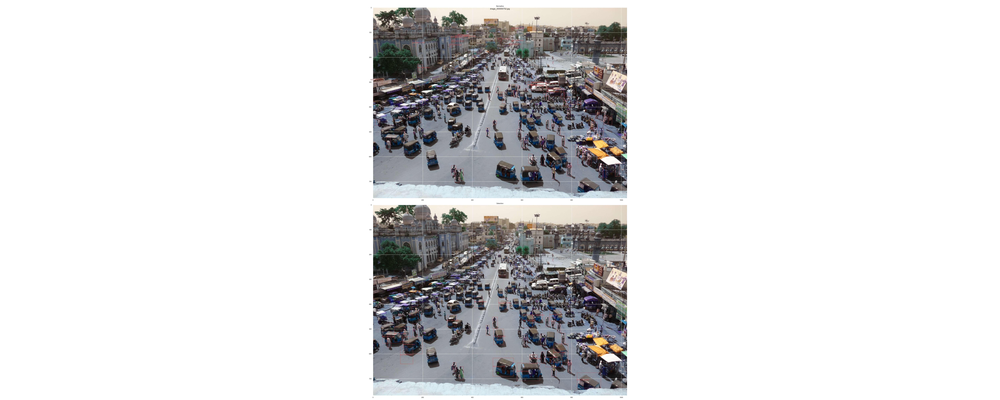
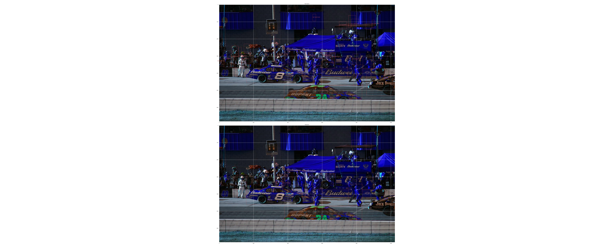
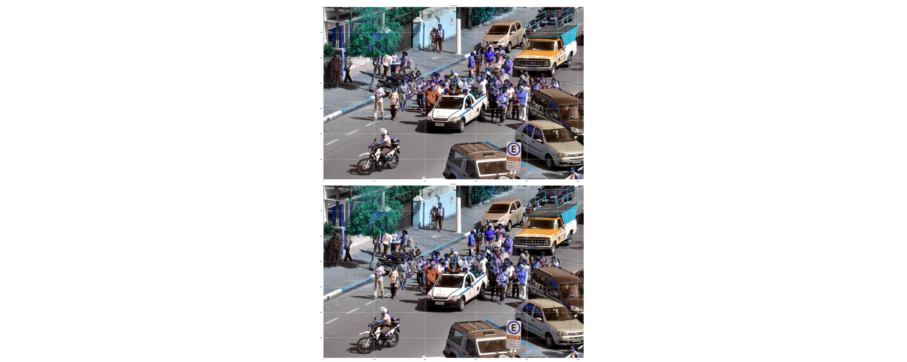
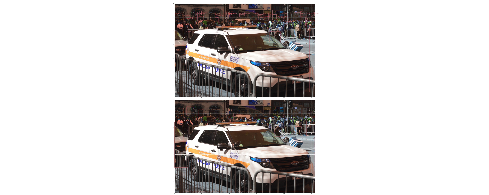

# Person and car detector with yolov5

#### Links to dataset and framework:

Source dataset : [link](https://evp-ml-data.s3.us-east-2.amazonaws.com/ml-interview/openimages-personcar/trainval.tar.gz)

yolov5 clone : [link](https://github.com/ultralytics/yolov5)

#### About yolov5:

YOLO an acronym for 'You only look once', is an object detection algorithm that divides images into a grid system. Each cell in the grid is responsible for detecting objects within itself.

More info can be obtained on the above repo link . 

YOLO is one of the most famous object detection algorithms due to its speed and accuracy.

Since we will be using yolov5 architecture we have the option to adapt with varying image sizes so we can train them at single scale with rect and multiscale param ON and then while on detection we can bucket them into batches of image size and run detection for each batch with customized "image_size" param
 
#### Primary analysis
The dataset is conatins 2239 images , hence lets first have a primary analysis of the dataset to see the variance in image properties.

We will be using the image_primary_analysis.py script to get this basic details.

````
 total images :  2239
 minimum and maximum width of images are 575,4496 respectively
 minimum and maximum height of images are 282,3000 respectively
````
 
Note : Also a sanity analysis is done to check if there exists any greyscale or image saturation level variance is high .
 
 
 As from the primary analysis its evident that the images are not varying much in height and width so we might not need the batch bucketing part unless results prove to be bad.
 
 Also we see that the images are very generic as in coco dataset and since our classes of interest (person and cars ) are part of the coco weight labels we should be able to achieve a decent detection model with the pretrained nets .
  
#### Assumptions:
* We assume that the null distribution is true and hence the current dataset is a sample of the future detection values. 
* We assume that crowding of label is true and not so evident labels can be ignored.
* considering the whole dataset as test set

Note : From bounding box analysis we see that there are labels of smaller size as well hence its safe to use "L" nets for better recall on smaller objects.

#### metrics:
* Since this is an core object detection task we will consider the False positives and False negatives ( Error 1 and Error 2) as out metrics to judge the model 
* A possible confusion matrix can be plotted with keeping 0.75 IOU and background as our third class.

#### Inference:
We dont need to break the dataset into train , eval and test anymore since we will examine the inference on the pretrained model directly.

The detection module can be run using detect.py script as below

python detect.py --weights ./weights/yolov5l.pt --img 1200 --conf-thres 0.3 --source [path to test images folder] --save-txt

- a small post processing has to be done as coco dataset by default has person as class 0 and car as class as 2 , and our dataset has cars as label 1 , we need to replace 2 with 1 in labels
which can be found in evaluate scores.py script. 

Note: The results are stored in run folder under root directory

We now will use metrics_od.py and evaluate_scores.py script to get the confusion matrix with background as a class and FP/FN/TP count respectively.


we see that the false positive and false negative rate is about 29 % , which shows the model is performing just decent , so lets check where the false positives and negatives are occuring and see if there is a pattern .

TP : 71%
FP : 29%
FN : 29%

lets see the top 10 images with most False positives and false negatives
##### False positives
 
  
  
 
 
  
  
  
  
  
 
##### False negatives
 
  
  
 
 
  
  
  
  
 
   
 
 legends: top : ground truth , bottom : predicted
 
 ### Conclusion:
The above images show that the model is performing fair enough and the false positives are mostly those labels which were skipped in ground truth labeling either as a crowd or for being too small.
and the False negatives are the labels which were too small for the detector which has an area of scope for improvement by playing around with the hyper parameters mainly confidence and img-size.

### Future to-do's :

* Improving the false negative score by hyper parameter tuning.
* Transfer learn the pretrained model by splitting a section of dataset as train and eval.
* Dockerize the whole module for easy access.    
  